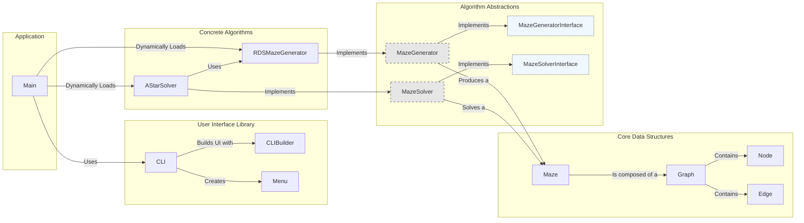

# CLI Maze

A Java-based CLI application for visualizing maze generation and solving algorithms in real-time, directly in your terminal. This project was developed as an exercise to explore graph theory, advanced algorithms, and clean terminal rendering in Java.

### Core Features

-   **Real-time Visualization:** Watch algorithms like Randomized Depth-First Search build the maze step-by-step.
-   **Clean CLI Rendering:** Uses Unicode box-drawing and block characters for a modern and clear visual representation.
-   **Extensible by Design:** The underlying graph structure allows for easy implementation of new generation and solving algorithms.
-   **Pure Java:** Built with standard Java libraries to focus on core language concepts and algorithms.

## Preview


## Components

The project has been refactored into a modular and extensible structure, with a clear separation of concerns between the UI, core data structures, and algorithms.

### Main Class
The application's entry point (`src/Main.java`). It is responsible for:
- Initializing and displaying the main menu.
- Managing a map of available generation and solving algorithms.
- Dynamically loading and executing the chosen algorithm using Java Reflection, making the system easily extensible.

### CLI Package (`src/libraries/cli`)
A comprehensive toolkit for building the command-line interface. Its key responsibilities include:
- **Global Logo:** Storing the application's logo in a static `CLI.logo` property for consistent branding.
- **Menu System:** Creating interactive, numbered, or roman-style menus.
- **User Input:** Handling various types of user input (numbers, booleans, strings).
- **Styled Output:** Applying colors and styles to text for an enhanced user experience.

### Graph Package (`src/libraries/graph`)
Provides a generic and reusable graph data structure, which is the foundation for the maze representation. It consists of `Graph`, `Node`, and `Edge` classes.

### Maze Package (`src/libraries/maze`)
This package contains all the logic related to the maze itself, including its structure, generation, and solving algorithms.

- **Core Maze Structure:**
  - `Maze`: Represents the maze, built upon the `Graph` data structure. It handles the grid-based visualization.
  - `NodeData` & `EdgeData`: Store maze-specific data for each node (e.g., coordinates, start/end points) and edge (e.g., if it's a wall).

- **Algorithm Abstractions:**
  - `MazeGenerator` & `MazeGeneratorInterface`: Define the contract and base implementation for all maze generation algorithms.
  - `MazeSolver` & `MazeSolverInterface`: Define the contract and base implementation for all maze-solving algorithms.

- **Concrete Algorithms:**
  - `RDSMazeGenerator`: Implements the **Recursive Backtracking** algorithm (Randomized Depth-First Search) to generate a perfect maze.
  - `AStarSolver`: Implements the **A*** search algorithm to find the shortest path between two points in the maze.

Each algorithm class contains a static `startUserInteraction()` method, which is responsible for gathering the necessary input from the user before the algorithm runs.

## Architecture Diagram


## How to Run

1.  **Clone the repository:**
    ```bash
    git clone https://github.com/S0meW3lls/cli-maze.git
    cd cli-maze
    ```

2.  **Run the application:**
    Use the provided shell script to compile and run the project.
    ```bash
    ./run.sh
    ```

3.  **Run in Debug Mode:**
    To start the application in debug mode and have it wait for a debugger to attach on port 5005, run:
    ```bash
    ./run.sh debug
    ```
---
This project is licensed under the MIT License - see the [LICENSE](LICENSE) file for details.