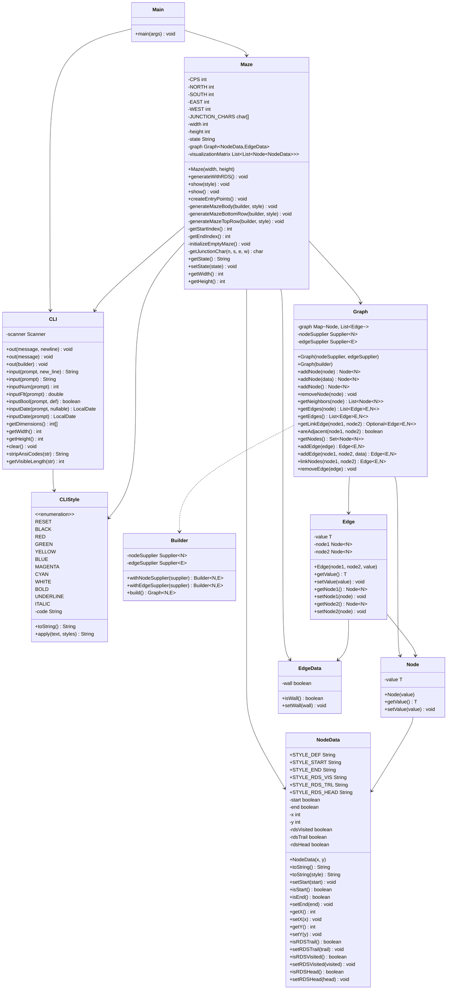

# Maze Generator

A Java-based CLI application for visualizing maze generation and solving algorithms in real-time, directly in your terminal. This project was developed as an exercise to explore graph theory, advanced algorithms, and clean terminal rendering in Java.

### Core Features

-   **Real-time Visualization:** Watch algorithms like Randomized Depth-First Search build the maze step-by-step.
-   **Clean CLI Rendering:** Uses Unicode box-drawing and block characters for a modern and clear visual representation.
-   **Extensible by Design:** The underlying graph structure allows for easy implementation of new generation and solving algorithms.
-   **Pure Java:** Built with standard Java libraries to focus on core language concepts and algorithms.

## Preview


## How it Works

The project is divided into three main components:

### CLI Management
The `src/libraries/cli` directory contains all the necessary classes to build and manage the command-line interface. This module is responsible for:
- Rendering the maze and other UI components in the terminal.
- Handling user input.
- Styling the CLI for a better user experience.

### Graph Representation
The core data structure of the application resides in the `src/libraries/graph` directory. This module handles:
- The representation of the maze as a graph.
- Nodes and Edges of the graph.
- The underlying data structures for storing the graph.

### Maze Generation
The `src/libraries/maze` directory contains the logic for generating the maze. This module handles:
- The implementation of the Randomized Depth-First Search algorithm.
- The creation of the maze structure.
- The visualization of the maze generation process.

## Class Map
```
.
├── run.sh
├── src
│   ├── Main.java
│   └── libraries
│       ├── cli
│       │   ├── CLI.java
│       │   └── CLIStyle.java
│       ├── graph
│       │   ├── Edge.java
│       │   ├── Graph.java
│       │   └── Node.java
│       └── maze
│           ├── Maze.java
│           └── data
│               ├── EdgeData.java
│               └── NodeData.java
└── README.md
```

## Class Diagram


## How to Run

1.  **Clone the repository:**
    ```bash
    git clone https://github.com/your-username/Maze-Generator.git
    cd Maze-Generator
    ```

2.  **Run the application:**
    Use the provided shell script to compile and run the project.
    ```bash
    ./run.sh
    ```

3.  **Run in Debug Mode:**
    To start the application in debug mode and have it wait for a debugger to attach on port 5005, run:
    ```bash
    ./run.sh debug
    ```
---
This project is licensed under the MIT License - see the [LICENSE](LICENSE) file for details.